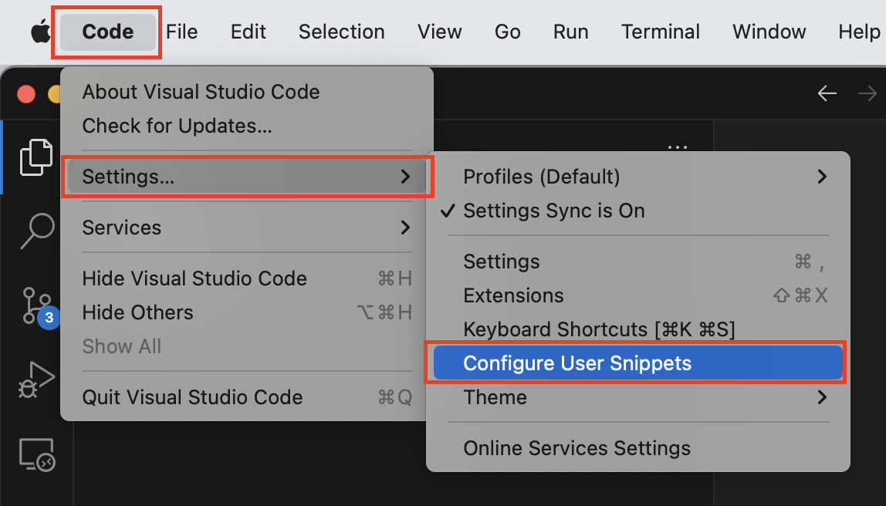
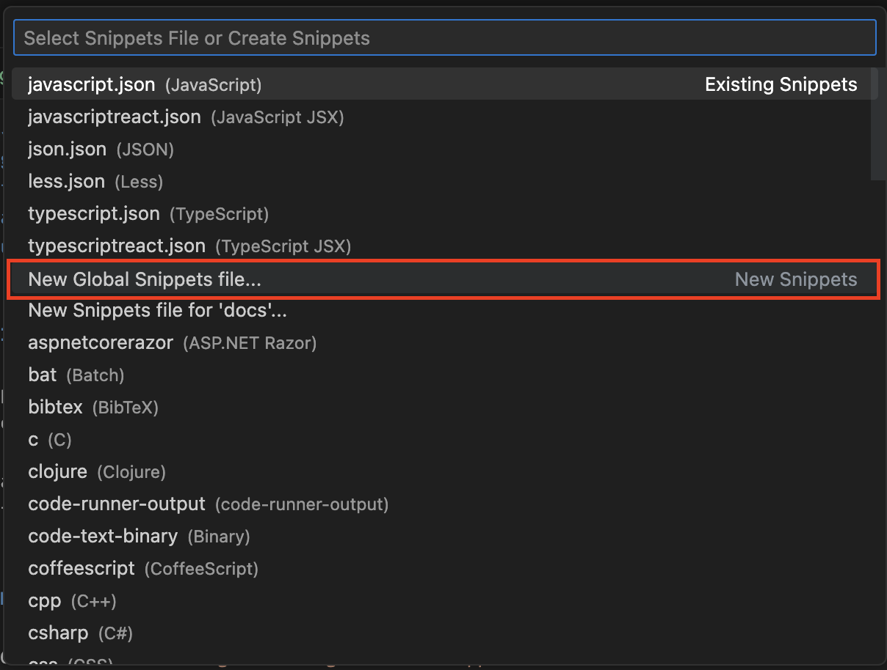
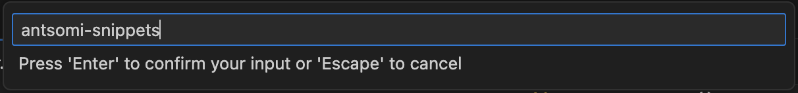
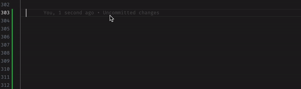
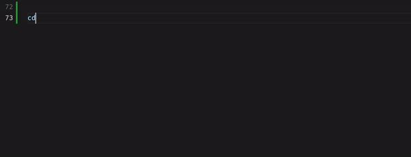

## Introduction

Snippets are small code templates that can be quickly inserted into your code to help you write code faster and more efficiently. Snippets can be used to automate repetitive tasks, save time, and reduce errors.

Create custom snippets can be useful if you have your own code templates that you use frequently or if you want to customize existing snippets to better suit your coding style or preferences.


## How to create custom Snippets in Visual Studio Code

1. Go to `Code > Settings > Configure User Snippets`
  > You can use Keyboard shorcut: `Ctrl + Shift + P` or `Shift + cmd + P` for macOS and typing "Configure User Snippets"

  

2. Chose `New Global Snippets file...`

  

3. Save new file as

  

4. Create example snippet

  ```json
  {
    "Print to console": {
      "scope": "javascript,typescript,javascriptreact,typescriptreact",
      "prefix": "clog",
      "body": ["console.log('This is a custom log $1');", "$2"],
      "description": "Log output to console"
    }
  }
  ```

  :::note

  **`"Print to console"`:** is the name of snippet. <br />
  **`"scope": "javascript,typescript,javascriptreact,typescriptreact"`:** specifies the programming languages and frameworks in which this snippet can be used. In this case, it applies to JavaScript, TypeScript, JavaScript React, and TypeScript React. <br />
  **`"prefix": "clog"`:** is the short code that triggers the insertion of the snippet. In this case, typing `clog` and pressing the `Tab` key will trigger this snippet. <br />
  **`"body": ["console.log('This is a custom log $1');", "$2"]`:** is the code that will be inserted when the snippet is triggered. <br />
  **`"description": "Log output to console"`:** is a short description of what the snippet does.

  :::

## Sample Snippets

### Function with trycatch

  ```json title="antsomi-snippets.code-snippets"
  {
    ...
    "Function with trycatch": {
      "scope": "javascript,typescript,javascriptreact,typescriptreact",
      "prefix": "ftc",
      "body": [
        "const $1 = (params) => {",
        "    try {",
        "       $2",
        "    } catch (error) {",
        "        handleError(error, {",
        "            path: PATH,",
        "            name: '$1',",
        "            args: {}",
        "        });",
        "    }",
        "}"
      ],
      "description": "Generate a function with try catch"
    }
    ...
  }
  ```

  

### CDP Function with trycatch

  ```json title="antsomi-snippets.code-snippets"
  {
    ...,
    "CDP Function with trycatch": {
      "scope": "javascript,typescript,javascriptreact,typescriptreact",
      "prefix": "cdp-ftc",
      "body": [
        "const $1 = (params) => {",
        "  try {",
        "    $2",
        "  } catch (error) {",
        "    addMessageToQueue({",
        "      path: PATH,",
        "      func: '$1',",
        "      data: error.stack,",
        "    });",
        "    console.log(error);",
        "  }",
        "};"
      ],
      "description": "Generate a CDP function with try catch",
    },
    ...
  }

  ```

  